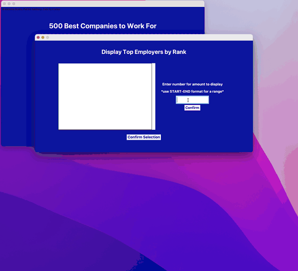

# 500 Best Companies to Work For
Developed by:
- Katerina Bosko: back end (web scraping, SQL database)
- Patrick Salsbury: front end (GUI, plotting)

## Description


An exploratory data analysis project that showcases the differences and similarities in attributes regarding the top 500 companies to work for according to Forbes.com

Data set size: 500 rows x 8 columns.

Here's an example a of typical record in JSON format:
```
   {
      "rank": "207",
      "name": "PepsiCo",
      "industry": "Food, Soft Beverages, Alcohol & Tobacco",
      "employees": "116,000",
      "year_founded": "1965",
      "url": "https://www.forbes.com/companies/pepsico/",
      "desc": "PepsiCo, Inc. engages in the manufacture, marketing, distribution and sale of beverages, food, and snacks. It is a food and beverage company with a complementary portfolio of brands, including Frito-Lay, Gatorade, Pepsi-Cola, Quaker, and Tropicana. It operates through the following business segments: Frito-Lay North America; Quaker Foods North America; North America Beverages; Latin America; Europe Sub-Saharan Africa; and Asia, Middle East, and North Africa. The Frito-Lay North America segment markets, distributes, and"
      "headquarters": "Purchase, New York"
   }
```

## Implementation
The project consists of 4 parts organized in the following files:


#### 1_web.py
Consists of 2 parts: 
- code to scrape javascript-generated content (data table and urls) using Selenium
- code to scrape headquarters and description of each company by going into each url

Missing data is encoded as “-1”

Generates `companies_final.json`

#### 2_data_cleaning.py
Consists of 2 parts:
- Data Cleaning:
  1. getting state from headquarter variable  and encoding companies without state as ‘international’
  2. clean descriptions (some of them end abruptly in the middle of the sentence)

- Dealing with missing data in state variable (25 cases)
  1. add missing information about the state for universities in our list from topcolleges.csv file
  2. add missing information for universities in our list if the name has a state in its name
  3. substitute manually for the remaining companies without state (6 cases)
  
Generates `companies_clean.json`

#### 3_database.py
Creates a SQL database using sqlite3 module. Database has 3 tables:
 - Companies
 - Industries (foreign key in Companies)
 - States (foreign key in Companies)
 
Generates `companies.db`

#### main.py

GUI using tkinter and plotting using matplotlib modules based on data imported from ‘companies.db’
Contains 6 Classes:
 - MainWindow (subclass of tk.Tk)
   - main window holding the four choices: Display by top employers by rank, display by industry, display by location, and display by trends
 - DisplayListWindow(subclass of tk.Toplevel)
   - generic listbox window consisting of only a label and a listbox
   - displays employer information
- DisplayListButtonWindow(subclass of DisplayListWindow)
   - same as DisplayListWindow except with an additional button in order to confirm selected
- NumDisplayWindow(subclass of DisplayListButtonWindow)
  - same as DisplayListButtonWindow except with additional functionality to enter a number/range into an entry widget and hit a confirm button to display specific employers by ranking
- RadioButtonWindow(subclass of tk.Toplevel)
  - used as a nicer way to query the user for which trend to show
- PlotWindow(subclass of tk.Toplevel)
  - displays one of the four trends in its own window:
       - Distribution by Employees (histogram of data without outliers with annotations)
       - Distribution by Year Founded (histogram of data without outliers with annotations)
       - Number of Companies by Industry (horizontal bar chart with annotations)
       - Number of Companies by Location (horizontal bar chart with annotations)
       
## Insights
Some surprising facts based on data:
- The biggest employer in the dataset is the United States Department of Defense (rank 358) with 2.87 mln employees 
- There are quite a few companies founded in the 18-19th centuries that are not only still functioning but also among the best companies to work for (the oldest being Harvard University founded in 1636)
- At the same time, not so many companies that were founded after 2000 made into the list (only 31)
- Among the most common industries in the list are those where you work with people a lot: 
    - Travel & Leisure
    - Retail & Wholesale
    - Healthcare & Social 
    - Government Services
    - Education
    - Clothing, Shoes, Sports equipment

## Acknowledgement

The project is based on ["America's Best Large Employers 2021"](https://www.forbes.com/best-large-employers/) by Forbes.

The project was part of Advanced Python class (CIS 41B) at De Anza College taught by Clare Nguyen.


